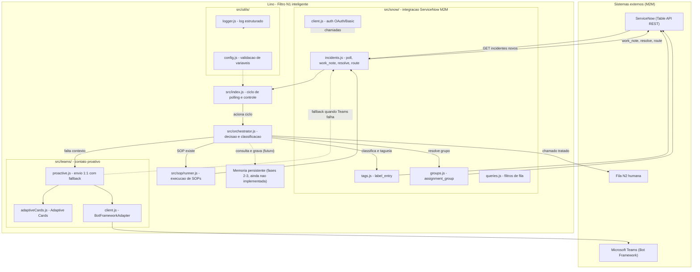
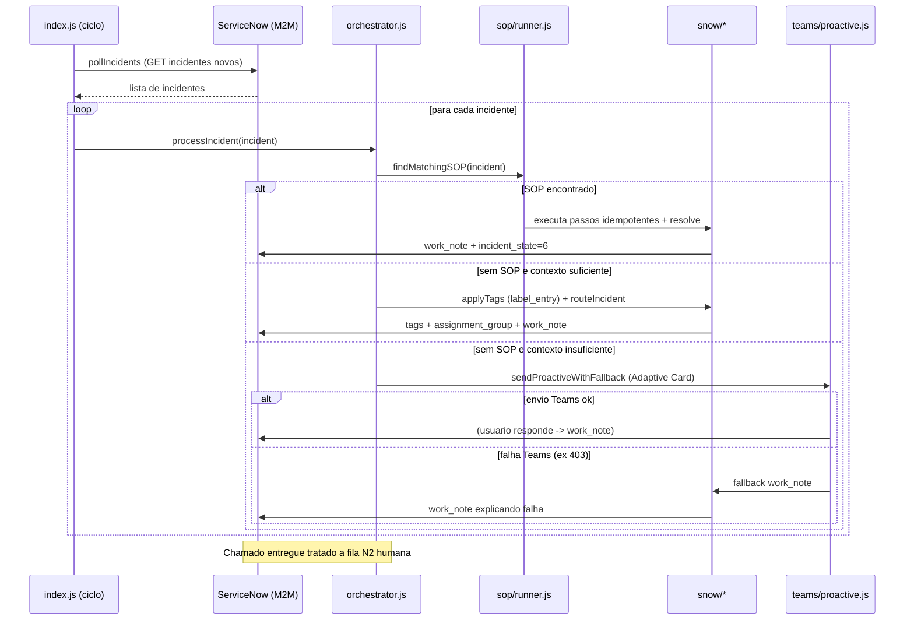
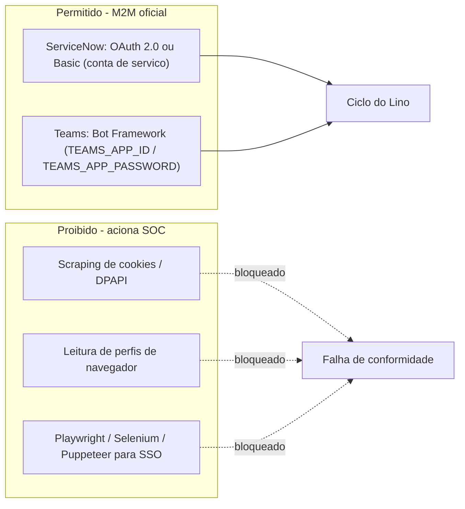
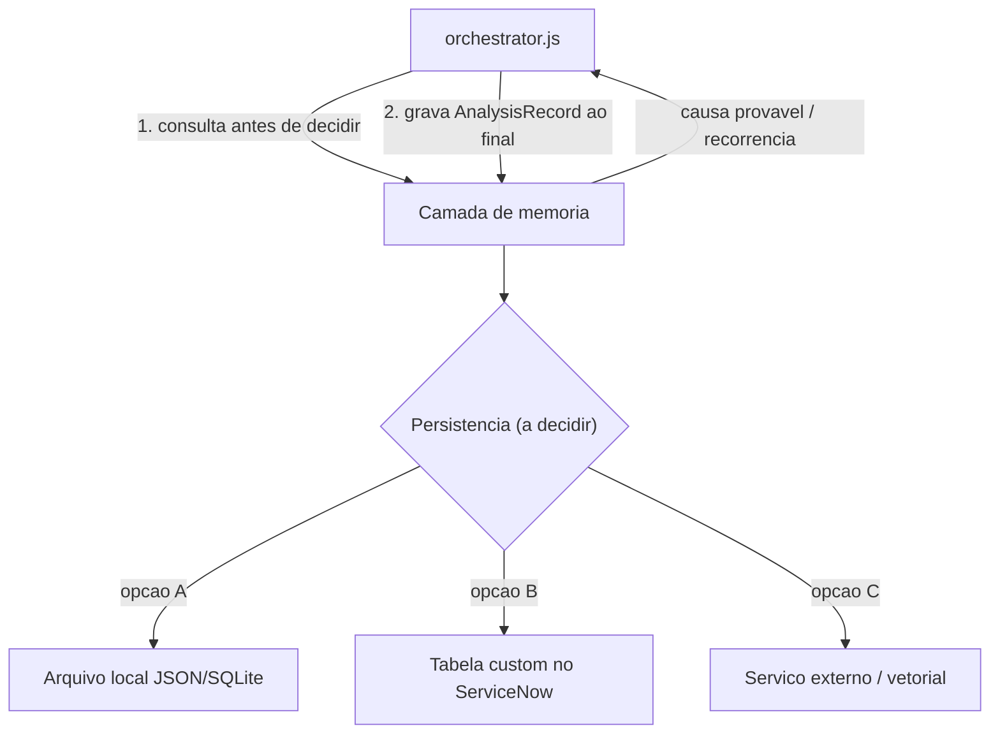

# Arquitetura — Agente Lino (Filtro N1 Inteligente)

> Mapeia o conceito do Lino (N1) aos módulos de código **já existentes** em `src/`.
> Este documento é descritivo: não propõe alterações de código nem de autenticação (a arquitetura é
> M2M — ServiceNow via OAuth/Basic, Teams via Bot Framework).

---

## 1. Visão de componentes

O diagrama abaixo mostra o Lino como camada N1 orquestrando os módulos existentes. Cada nó do grupo
"Lino" corresponde a um arquivo real em `src/`.

---

## 2. Mapeamento capacidade → módulo

| Capacidade do Lino | Módulo(s) responsável(is) | Papel |
|--------------------|---------------------------|-------|
| Polling / interceptação | `src/index.js`, `src/snow/incidents.js`, `src/snow/queries.js` | Consulta a Table API a cada ciclo e obtém incidentes novos sem atribuição |
| Decisão / classificação | `src/orchestrator.js` | Aplica o fluxo de decisão (SOP → contexto → classificação/roteamento) |
| Integração ServiceNow (M2M) | `src/snow/client.js` + `incidents.js`, `tags.js`, `groups.js` | Autenticação OAuth/Basic e operações de leitura/escrita idempotentes |
| Execução de SOPs | `src/sop/runner.js` | Resolução automática idempotente para chamados cobertos por SOP |
| Contato proativo | `src/teams/proactive.js`, `adaptiveCards.js`, `client.js` | Diálogo 1:1 via Bot Framework, com fallback para `work_note` |
| Configuração / auditoria | `src/utils/config.js`, `src/utils/logger.js` | Validação de variáveis (Falha Rápida) e log estruturado |
| Memória persistente | _(não implementado — fases 2/3)_ | Histórico de análises e base de recorrências (ver ESPECIFICACAO §5) |

---

## 3. Sequência de um ciclo (interceptação → entrega N2)

Todo caminho de escrita registra `execution_id` (Pilar 2). Erros 401/403/rede suspendem o ciclo em
`index.js` (Pilar 1).

---

## 4. Fronteira de segurança (M2M)

- A autenticação ServiceNow está centralizada em `src/snow/client.js`; a do Teams em
  `src/teams/client.js` (`BotFrameworkAdapter`).
- As proibições seguem `.cursor/rules/security-auth.mdc`. A camada de memória futura (seção 1) deverá
  usar apenas persistência aprovada (ver trade-offs em `ESPECIFICACAO.md` §5.3), sem novas superfícies
  de credencial não governadas.

---

## 5. Onde a memória persistente se encaixa (futuro)

A memória (fases 2/3) entra como uma dependência **consultada e gravada pelo `orchestrator.js`**, sem
alterar os módulos de integração:

A escolha de persistência é uma decisão de backlog (ver `BACKLOG.md`), não uma alteração deste
mapeamento arquitetural.

---

## 6. Documentos relacionados

- [`ESPECIFICACAO.md`](ESPECIFICACAO.md) — identidade, capacidades, fluxo, memória e contratos.
- [`GLOSSARIO.md`](GLOSSARIO.md) — termos técnicos.
- [`BACKLOG.md`](BACKLOG.md) — épicos, histórias e proposta de reorganização de pastas.
- [`../DEPLOY-AZURE-DEVOPS.md`](../DEPLOY-AZURE-DEVOPS.md) — exportação para Azure DevOps e credenciais M2M.
