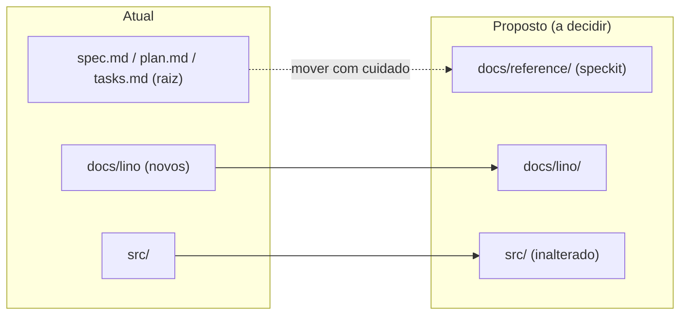
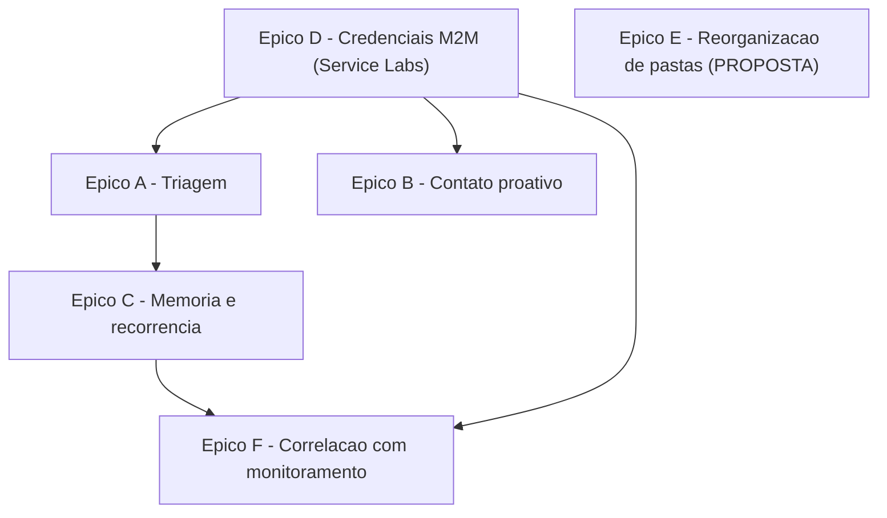

# Backlog — Agente Lino (Filtro N1 Inteligente)

> Épicos → histórias estruturadas para evoluir o Lino por fases (ver `ESPECIFICACAO.md` §8).
> Este backlog é um artefato de planejamento. **Nada aqui altera código, autenticação ou a estrutura
> física de pastas**; a reorganização de diretórios (Épico E) é registrada apenas como **proposta**.

## Convenções

- **Formato das histórias:** _Como \<papel\>, quero \<capacidade\>, para \<benefício\>._
- **Prioridade:** `P0` (crítica), `P1` (alta), `P2` (média), `P3` (baixa).
- **Fase:** referência ao roadmap da especificação (Fase 1 / 2 / 3).
- **Estado:** `todo` (não iniciado), `parcial` (base existente no código), `bloqueado` (depende de terceiro).

---

## Épico A — Fundação de Triagem (Fase 1)

Consolidar a triagem N1 já existente e alinhá-la à visão do Lino.

| ID | História | Prioridade | Estado | Critérios de aceitação |
|----|----------|------------|--------|------------------------|
| A1 | Como operação, quero que o Lino **intercepte incidentes novos sem atribuição** a cada ciclo, para tratá-los antes da fila N2. | P0 | parcial | Poll a cada 2 min; filtra `active=true^assigned_to=NULL^sys_updated_on>-2min`; ciclo não bloqueante |
| A2 | Como operação, quero que o Lino **classifique sintoma + contexto**, para direcionar corretamente. | P0 | parcial | Produz categoria, sintoma e grupo-alvo; texto tratado como dado inerte (anti prompt-injection) |
| A3 | Como operação, quero **roteamento com tags via `label_entry`**, para evitar falhas silenciosas de `sys_tags`. | P0 | parcial | Tags aplicadas via `label_entry`; sem duplicatas; `assignment_group` correto |
| A4 | Como auditor, quero **`execution_id` em toda escrita**, para rastreabilidade. | P0 | parcial | Toda `work_note`/escrita contém `execution_id` e timestamp ISO-8601 |
| A5 | Como operação, quero que **falhas 401/403/rede suspendam o ciclo** (Falha Rápida), para não mascarar problemas. | P0 | parcial | Ciclo suspende e loga; humano (Felipe/Joel) é informado; sem retomada automática |

**Dependências:** credenciais M2M ServiceNow válidas (ver Épico D).

---

## Épico B — Contato Proativo (Fase 1)

Garantir coleta de contexto quando o chamado chega incompleto.

| ID | História | Prioridade | Estado | Critérios de aceitação |
|----|----------|------------|--------|------------------------|
| B1 | Como usuário, quero receber um **Adaptive Card 1:1 no Teams** pedindo o dado que falta, para agilizar meu chamado. | P1 | parcial | Card com `Action.Execute`; enviado via Bot Framework; resposta vira `work_note` |
| B2 | Como operação, quero **fallback para `work_note`** quando o Teams falhar (ex.: 403), para não interromper o ciclo. | P1 | parcial | Em falha de envio, registra `work_note` explicando e segue com os demais tickets |
| B3 | Como operação, quero **detecção de contexto insuficiente** configurável, para calibrar quando pedir dados. | P2 | todo | Regras de suficiência ajustáveis; documentado o critério usado |
| B4 | Como operação, quero que a solicitação de contexto seja **idempotente**, para não incomodar o usuário repetidamente. | P1 | todo | Não reenvia se já houve solicitação com mesmo `execution_id`/marcador no ticket |

**Dependências:** credenciais M2M Teams (Bot Framework) válidas (ver Épico D).

---

## Épico C — Memória Persistente e Recorrência (Fase 2)

Transformar o N1 em "inteligente" com histórico e reconhecimento de padrões.

| ID | História | Prioridade | Estado | Critérios de aceitação |
|----|----------|------------|--------|------------------------|
| C1 | Como arquiteto, quero **decidir a estratégia de persistência** (local vs. tabela ServiceNow vs. externo), para embasar a implementação. | P0 | todo | ADR registrando trade-offs (ver `ESPECIFICACAO.md` §5.3) e decisão |
| C2 | Como operação, quero que o Lino **grave um `AnalysisRecord`** por análise, para construir memória de longo prazo. | P1 | todo | Registro conforme contrato §6.2; sem segredos; timestamps ISO-8601 |
| C3 | Como operação, quero **normalização de sintoma**, para servir de chave de recorrência. | P1 | todo | Função determinística `texto → sintoma normalizado`; documentada e testável |
| C4 | Como operação, quero **análise de recorrência determinística**, para sugerir causa provável. | P1 | todo | Match por chave/fingerprint; anexa hipótese como `work_note` (não resolve) |
| C5 | Como analista N2, quero que a **causa provável seja hipótese** (chamado permanece aberto), para manter Human-in-the-Loop. | P0 | todo | Nenhum fechamento automático fora de SOP; hipótese claramente rotulada |

**Dependências:** Épico A concluído; decisão de C1; se a opção for tabela ServiceNow, depende de
modelagem e aprovação (Épico D).

---

## Épico D — Credenciais e Contas de Serviço M2M (transversal, bloqueante)

Sem credenciais válidas, nenhuma fase opera. Segue integralmente `.cursor/rules/security-auth.mdc`
(somente M2M; proibido scraping de cookies/DPAPI/Playwright).

| ID | História | Prioridade | Estado | Critérios de aceitação |
|----|----------|------------|--------|------------------------|
| D1 | Como operação, quero uma **conta de serviço ServiceNow (OAuth ou Basic)** provisionada pela **Service Labs**, para autenticação M2M. | P0 | bloqueado | `SNOW_CLIENT_ID`/`SECRET` ou `SNOW_USERNAME`/`PASSWORD` válidos; privilégios de leitura/escrita nas tabelas necessárias |
| D2 | Como operação, quero o **App do Bot no Azure AD** (Bot Framework) configurado, para mensagens proativas no Teams. | P0 | bloqueado | `TEAMS_APP_ID`, `TEAMS_APP_PASSWORD`, `TEAMS_TENANT_ID`, `TEAMS_SERVICE_URL` válidos |
| D3 | Como segurança, quero **rotação de segredos a cada 90 dias**, para conformidade. | P1 | todo | Processo documentado; segredos nunca versionados nem logados |
| D4 | Como arquiteto, quero **escopo mínimo de privilégios** para a conta de serviço, para reduzir risco. | P1 | bloqueado | Permissões restritas às tabelas/endpoints usados; validado com Service Labs |
| D5 | (Fase 3) Como operação, quero **acesso M2M às tabelas de `problem`/monitoramento**, para correlação de causa. | P2 | bloqueado | Conta de serviço com leitura nas tabelas de monitoramento aprovada |

> **Nota de dependência crítica:** os Épicos A, B, C e F **dependem** de D1/D2. Enquanto as
> credenciais da **Service Labs / conta de serviço M2M** não forem entregues e validadas, as histórias
> permanecem `bloqueado`. Em erro 401/403, aplicar Falha Rápida e acionar o humano responsável
> (Felipe/Joel) — **nunca** contornar autenticação.

---

## Épico E — Reorganização Física de Pastas (PROPOSTA — não executar)

> ⚠️ **Somente proposta.** Nenhuma movimentação/renomeação deve ser feita como parte deste backlog.
> Mover arquivos do speckit (`spec.md`, `plan.md`, `tasks.md`) quebra referências e exige cuidado.

### Estrutura atual (resumida)

```text
lino/                    # identidade do produto (pasta física pode manter nome legado)
├── spec.md            # speckit (raiz)
├── plan.md            # speckit (raiz)
├── tasks.md           # speckit (raiz)
├── constitution.md
├── docs/
│   ├── lino/          # documentos de visão de produto do Lino
│   └── DEPLOY-AZURE-DEVOPS.md
├── src/               # código (index, orchestrator, snow/, teams/, sop/, utils/)
├── sops/
├── azure-pipelines.yml
└── .cursor/rules/     # constitution.mdc, security-auth.mdc
```

### Estrutura-alvo proposta

```text
lino/
├── docs/
│   ├── lino/          # visão de produto do Lino (ESPECIFICACAO, ARQUITETURA, GLOSSARIO, BACKLOG)
│   ├── DEPLOY-AZURE-DEVOPS.md
│   └── reference/     # spec.md, plan.md, tasks.md (speckit) — proposta de movimentação
├── src/               # código (mantido, sem alteração)
├── sops/
├── azure-pipelines.yml
└── .cursor/rules/     # mantido
```



| ID | História | Prioridade | Estado | Critérios de aceitação |
|----|----------|------------|--------|------------------------|
| E1 | Como mantenedor, quero **avaliar mover os arquivos speckit para `docs/reference/`**, para consolidar a documentação. | P3 | todo (proposta) | Levantamento de todas as referências a `spec.md`/`plan.md`/`tasks.md` antes de qualquer mudança |
| E2 | Como mantenedor, quero **confirmar o impacto no fluxo speckit** antes de mover, para não quebrar `/speckit.*`. | P3 | todo (proposta) | Validado que o speckit tolera a nova localização, ou decisão de manter na raiz |
| E3 | Como mantenedor, quero um **índice em `docs/`** apontando para lino/ e reference/, para navegação. | P3 | todo (proposta) | `docs/README.md` (ou índice) com links, criado somente se a proposta for aprovada |

---

## Épico G — Publicação e Azure DevOps (parcialmente concluído)

| ID | História | Prioridade | Estado | Critérios de aceitação |
|----|----------|------------|--------|------------------------|
| G1 | Como mantenedor, quero **identidade do projeto como Lino**, para publicação consistente. | P1 | concluído | `package.json` (`@localiza/lino`), README, comentários em `src/` |
| G2 | Como mantenedor, quero **guia de deploy no Azure DevOps**, para onboarding e credenciais M2M. | P1 | concluído | `docs/DEPLOY-AZURE-DEVOPS.md` com passos Service Labs/Apigee |
| G3 | Como mantenedor, quero **pipeline CI básico**, para validar PRs. | P2 | concluído | `azure-pipelines.yml` com `npm test` |
| G4 | Como mantenedor, quero **`.env.example` limpo (somente M2M)`**, para conformidade de segurança. | P1 | concluído | Sem variáveis de browser/sessão; referência ao guia DevOps |
| G5 | Como mantenedor, quero **repositório espelhado no Azure DevOps**, para governança corporativa. | P1 | todo | Import ou push para `dev.azure.com`; pipeline verde |

---

## Épico F — Correlação com Monitoramento (Fase 3)

| ID | História | Prioridade | Estado | Critérios de aceitação |
|----|----------|------------|--------|------------------------|
| F1 | Como operação, quero **correlacionar chamados a `problem`/incidente-mãe ativos**, para evitar retrabalho. | P2 | todo | Consulta M2M; vincula e registra referência em `work_note` |
| F2 | Como operação, quero **recorrência por similaridade semântica** (embeddings), para agrupar variações do mesmo sintoma. | P2 | todo | Similaridade acima de limiar agrupa sintomas; limiar documentado |
| F3 | Como operação, quero que a correlação informe **"causa provável X"** sem fechar o chamado, para manter Human-in-the-Loop. | P1 | todo | Sempre hipótese; nenhum fechamento fora de SOP |

**Dependências:** Épico C (memória) e D5 (acesso M2M ao monitoramento).

---

## Mapa de dependências (visão geral)



---

## Documentos relacionados

- [`ESPECIFICACAO.md`](ESPECIFICACAO.md) — visão, capacidades, fluxo, memória e contratos.
- [`ARQUITETURA.md`](ARQUITETURA.md) — mapeamento aos módulos existentes.
- [`GLOSSARIO.md`](GLOSSARIO.md) — termos.
- [`../DEPLOY-AZURE-DEVOPS.md`](../DEPLOY-AZURE-DEVOPS.md) — exportação Azure DevOps e credenciais M2M.
- `../../.cursor/rules/security-auth.mdc` — diretriz de segurança M2M (proíbe scraping/DPAPI/Playwright).
