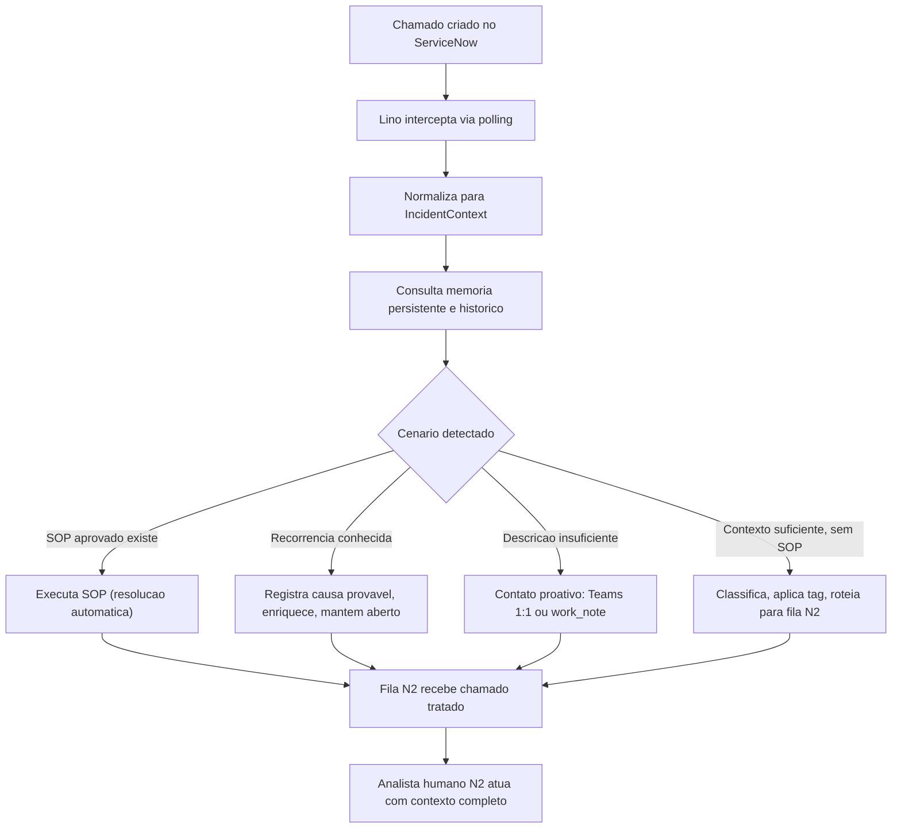
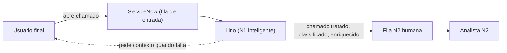
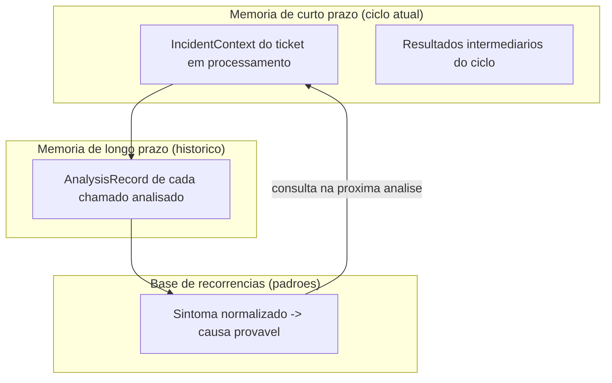
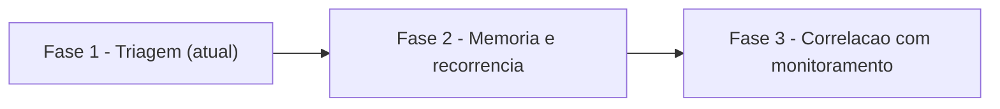

# Especificação — Agente Lino (Filtro N1 Inteligente)

> Documento de visão de produto. Descreve **o que** o Lino é e **por que** ele existe.
> Complementa (sem substituir) a `spec.md` gerenciada pelo speckit e a `constitution.md`.
>
> **Status:** vivo — evolui por fases (ver seção 8).
> **Escopo deste documento:** especificação conceitual e contratual. Nada aqui altera código em `src/` nem a autenticação M2M já estabelecida.

---

## 1. Identidade e Missão

**Nome:** Lino.
**Papel:** Filtro N1 inteligente / orquestrador de triagem automatizada.

O projeto nasceu com o rótulo "Agente N2", mas a visão real de produto é diferente e precisa ser
documentada com clareza:

- O **Lino é a primeira linha (N1)**. Ele **intercepta** o chamado no exato momento em que entra no
  ServiceNow, antes que ele chegue à fila humana.
- O Lino **não substitui** o analista humano N2. Ele **prepara o terreno**: filtra, enriquece,
  classifica e correlaciona, entregando à fila N2 um chamado **já tratado e mastigado**.

### Missão

> Reduzir o **MTTR** (Mean Time to Resolve) e o **ruído** na fila N2 entregando chamados
> enriquecidos, classificados e correlacionados com o histórico e o monitoramento — de forma que o
> analista humano receba o problema já contextualizado, e não um ticket cru.

### Princípios inegociáveis (herdados da Constituição)

O Lino opera sob os três pilares da `constitution.md`:

1. **Falha Rápida e Ruidosa** — erros de autenticação (401/403) e rede suspendem o ciclo
   imediatamente; nunca mascarar falhas críticas.
2. **Idempotência Operacional Absoluta** — consultar o estado antes de qualquer escrita; tags via
   `label_entry`; `execution_id` em toda `work_note`.
3. **Isolamento de Execução (Human-in-the-Loop)** — alterações em produção apenas via SOPs; sem SOP,
   classifica/roteia/pede contexto; nunca executa texto livre de chamado como código.

---

## 2. Capacidades (Pilares Funcionais)

O Lino é definido por seis capacidades. As capacidades marcadas com 🟢 já têm base no código atual;
as marcadas com 🟡 são metas das próximas fases (seção 8).

| # | Capacidade | Descrição | Estado |
|---|------------|-----------|--------|
| C1 | **Compreensão do chamado** | Interpretar `short_description` + `description` para extrair **sintoma**, **contexto** e **intenção**. Tratado sempre como dado, nunca como instrução (anti prompt-injection). | 🟢 base |
| C2 | **Classificação** | Determinar categoria, sintoma normalizado, criticidade e grupo-alvo de atendimento. | 🟢 base |
| C3 | **Memória persistente** | Registrar e consultar histórico de análises, decisões e recorrências (ver seção 5). | 🟡 fase 2 |
| C4 | **Consciência de monitoramento** | Correlacionar o chamado com incidentes/problemas ativos conhecidos: _"já sabemos que a causa é X"_. | 🟡 fase 3 |
| C5 | **Contato proativo** | Quando faltar dado (descrição/print), abrir diálogo — Teams 1:1 (Bot Framework) ou `work_note` no próprio chamado — pedindo a informação específica. | 🟢 base |
| C6 | **Enriquecimento e roteamento** | Aplicar tags (`label_entry`), anexar contexto e rotear para a fila/grupo correto. | 🟢 base |

### Detalhamento das capacidades

- **C1 — Compreensão.** O Lino lê os campos textuais do incidente e produz uma representação
  normalizada (o `IncidentContext`, seção 6). A leitura é puramente **passiva**: nenhum conteúdo de
  campo livre é interpretado como comando (Constituição, Pilar 3 / regra anti prompt-injection).

- **C2 — Classificação.** A partir do `IncidentContext`, o Lino atribui categoria e grupo. Hoje isso
  ocorre por correspondência de palavras-chave (`CATEGORY_ROUTING` em `src/orchestrator.js`); a
  evolução prevê classificação por similaridade com a base de recorrências (C3).

- **C3 — Memória persistente.** É o diferencial do Lino como N1 "inteligente": ele lembra do que já
  viu. Ver arquitetura completa na seção 5.

- **C4 — Consciência de monitoramento.** Antes de tratar um chamado como novo, o Lino verifica se há
  um `problem`/incidente-mãe ativo que já explica o sintoma. Em caso positivo, correlaciona e informa
  a causa provável em vez de reabrir a investigação do zero.

- **C5 — Contato proativo.** Quando o chamado chega sem contexto suficiente (ex.: "não funciona"), o
  Lino **não descarta e não adivinha**: ele pede o dado que falta. O canal preferencial é o Teams 1:1
  (Adaptive Card via Bot Framework); o fallback é uma `work_note` no próprio chamado (RF-05).

- **C6 — Enriquecimento e roteamento.** Fecha o ciclo do N1: adiciona tags via `label_entry`, escreve
  o resumo da análise em `work_notes` (com `execution_id`) e atribui ao `assignment_group` correto.

---

## 3. Fluxo de Decisão

Visão macro do ciclo do Lino:



### 3.1 Tabela de decisão por cenário

Cada linha define o gatilho, a ação, o canal, o resultado esperado e o artefato de auditoria. Todo
artefato de escrita carrega um `execution_id` (Constituição, Pilar 2).

| Cenário | Gatilho | Ação do Lino | Canal / Módulo | Resultado esperado | Artefato de auditoria |
|---------|---------|--------------|----------------|--------------------|-----------------------|
| **SOP aprovado** | Chamado casa com um SOP em `sops/` | Executa passos do SOP de forma idempotente; verifica estado antes de cada escrita | `src/sop/runner.js` + `src/snow/` (M2M) | Incidente resolvido (`incident_state=6`) e documentado | `work_note` com `execution_id` + `close_code` |
| **Recorrência conhecida** | Sintoma normalizado casa com padrão na base de recorrências (C3) | Anexa causa provável e correlação; **mantém o chamado aberto** para validação humana; enriquece | Memória persistente + `src/snow/` | Chamado enriquecido com hipótese de causa; N2 valida rápido | `work_note` com hipótese + link de correlação + `execution_id` |
| **Descrição insuficiente** | `IncidentContext` sem sintoma/contexto mínimo (ex.: sem `description` útil, sem print) | Contato proativo pedindo dado específico; se sem `aadObjectId`, cai para `work_note` | Teams 1:1 (Bot Framework) → fallback `work_note` | Usuário fornece print/dados; chamado volta ao ciclo mais completo | `work_note` de solicitação + registro de envio (RF-04/RF-05) |
| **Contexto suficiente, sem SOP** | Contexto ok, mas nenhum SOP aplicável | Classifica (sintoma+contexto), aplica tags, roteia ao grupo correto | `src/orchestrator.js` + `src/snow/tags.js` + `src/snow/groups.js` | Chamado classificado e roteado à fila N2 correta | `work_note` de roteamento + tags via `label_entry` + `execution_id` |
| **Correlação com monitoramento** | Existe `problem`/incidente-mãe ativo cobrindo o sintoma (C4) | Correlaciona ao registro-mãe; informa causa conhecida; evita duplicação de esforço | `src/snow/` (consulta) + memória | Chamado vinculado à causa raiz já mapeada | `work_note` com referência ao `problem` + `execution_id` |
| **Falha crítica (401/403/rede)** | Erro de autenticação ou rede em qualquer chamada | **Suspende o ciclo imediatamente** (Falha Rápida) | `src/index.js` (controle de ciclo) | Ciclo suspenso; humano notificado (Felipe/Joel) | Log estruturado (timestamp ISO-8601, skill, HTTP, mensagem) |
| **Ação irreversível sem SOP** | Ação de risco não coberta por SOP | Transborda para humano; **nunca improvisa** | Teams (Adaptive Card de aprovação) | Aprovação/rejeição humana antes de qualquer escrita | `work_note` com decisão humana + `execution_id` |

> **Observação de conformidade:** os cenários "Recorrência conhecida" e "Correlação com
> monitoramento" produzem **enriquecimento**, não resolução automática. Resolver/fechar continua
> restrito a SOPs aprovados (Constituição, Pilar 3).

---

## 4. Posicionamento N1 → N2



O valor do Lino está na **transformação** entre a fila de entrada e a fila N2: o que chegaria cru
chega mastigado. O analista humano deixa de gastar tempo em triagem repetitiva e passa a atuar sobre
problemas já contextualizados.

---

## 5. Arquitetura de Memória Persistente

A memória é o que separa um roteador de tickets de um **filtro N1 inteligente**. Ela é organizada em
três camadas.



### 5.1 Camadas

- **Memória de curto prazo (ciclo atual).** Estado volátil do ciclo de polling em andamento: o
  `IncidentContext` sendo processado e resultados intermediários. Vive apenas durante o ciclo.
- **Memória de longo prazo (histórico).** Histórico persistido de chamados analisados — um
  `AnalysisRecord` por análise. Permite responder "já vimos esse chamado/sintoma antes?".
- **Base de recorrências (padrões).** Camada derivada: agrupa sintomas normalizados e associa a
  causas prováveis e correlações. É consultada em toda nova análise para sugerir causa (C3/C4).

### 5.2 O que armazenar

Para cada análise, o Lino persiste (ver contrato na seção 6):

- Identificação: `number`, `sys_id`.
- **Sintoma normalizado** (chave de recorrência).
- Classificação: categoria, criticidade, grupo-alvo.
- Ação tomada e resultado.
- Links de correlação (ex.: `problem`, incidente-mãe).
- `execution_id` e timestamps ISO-8601.

> **Privacidade e segurança:** nenhum segredo/credencial é armazenado; nenhum dado sensível vai para
> logs (RNF-04). O conteúdo textual do chamado é tratado como dado inerte.

### 5.3 Opções de persistência (a decidir na implementação)

Nada é implementado neste documento; registram-se apenas os trade-offs para decisão futura (ver
BACKLOG).

| Opção | Prós | Contras |
|-------|------|---------|
| **Arquivo local (JSON / SQLite)** | Simples, zero dependência externa, rápido para MVP | Não compartilhado entre instâncias; backup/rotação manuais |
| **Tabela custom no ServiceNow** | Fica junto do dado-fonte; auditável no ITSM; governança nativa | Exige modelagem/aprovação; custo de API; latência |
| **Serviço externo (DB gerenciado / vetorial)** | Escala; suporta busca por similaridade semântica | Mais infra; nova superfície de credenciais M2M a governar |

### 5.4 Análise de recorrência

O Lino compara o **sintoma normalizado** do chamado novo com os padrões da base de recorrências. A
estratégia evolui por fase:

- **Fase 2 (inicial):** normalização + correspondência determinística (chaves/palavras-chave,
  fingerprint de sintoma).
- **Fase 3 (avançada):** similaridade semântica (embeddings) para agrupar variações do mesmo sintoma.

Ao encontrar um padrão com alta confiança, o Lino anexa a causa provável como **hipótese** (não como
resolução), mantendo o Human-in-the-Loop.

---

## 6. Contrato de Dados

Dois modelos definem a fronteira entre entrada e memória. São **contratos conceituais** (não código
de produção); os nomes de campos seguem o padrão ServiceNow para consistência.

### 6.1 `IncidentContext` (entrada normalizada)

Representação limpa e inerte do chamado, produzida por C1.

```json
{
  "number": "INC0012345",
  "sysId": "a1b2c3d4e5f6...",
  "shortDescription": "VPN nao conecta",
  "description": "Ao abrir o cliente VPN aparece erro 809. Print em anexo.",
  "caller": {
    "sysId": "usr_sys_id",
    "aadObjectId": "aad-guid-ou-null"
  },
  "symptom": "vpn:erro-conexao",
  "category": "vpn",
  "hasAttachments": true,
  "contextSufficient": true,
  "createdOn": "2026-07-08T18:40:00Z",
  "raw": { "note": "campos originais preservados, tratados como dado inerte" }
}
```

| Campo | Tipo | Descrição |
|-------|------|-----------|
| `number` | string | Número do incidente no ServiceNow |
| `sysId` | string | Identificador único do registro |
| `shortDescription` / `description` | string | Textos do chamado (dado, nunca instrução) |
| `caller.aadObjectId` | string \| null | Necessário para contato proativo via Teams (C5) |
| `symptom` | string | **Sintoma normalizado** — chave de recorrência |
| `category` | string | Categoria classificada (C2) |
| `contextSufficient` | boolean | Se há contexto mínimo para roteamento sem contato proativo |
| `createdOn` | string (ISO-8601) | Timestamp de criação |

### 6.2 `AnalysisRecord` (saída persistida)

O que o Lino grava na memória de longo prazo após tratar um chamado.

```json
{
  "executionId": "exec-2026-07-08-abc123",
  "incidentNumber": "INC0012345",
  "incidentSysId": "a1b2c3d4e5f6...",
  "symptom": "vpn:erro-conexao",
  "classification": {
    "category": "vpn",
    "criticality": "medium",
    "targetGroup": "Network Operations"
  },
  "scenario": "recorrencia_conhecida",
  "action": "enriquecido_com_causa_provavel",
  "outcome": "roteado_para_n2",
  "correlations": [
    { "type": "problem", "ref": "PRB0004567", "confidence": 0.86 }
  ],
  "proactiveContact": {
    "attempted": false,
    "channel": null,
    "fallbackWorkNote": false
  },
  "timestamps": {
    "analyzedAt": "2026-07-08T18:41:12Z"
  }
}
```

| Campo | Tipo | Descrição |
|-------|------|-----------|
| `executionId` | string | Identificador único da execução (auditoria — Pilar 2) |
| `symptom` | string | Sintoma normalizado (liga o registro à base de recorrências) |
| `classification` | objeto | Categoria, criticidade e grupo-alvo |
| `scenario` | enum | Cenário da tabela de decisão (seção 3.1) |
| `action` / `outcome` | string | Ação tomada e resultado |
| `correlations[]` | lista | Vínculos com `problem`/incidentes-mãe e confiança |
| `proactiveContact` | objeto | Se houve contato proativo, canal e uso de fallback |
| `timestamps.analyzedAt` | string (ISO-8601) | Momento da análise |

---

## 7. Segurança e Governança (referência cruzada)

Esta seção **reafirma** as diretrizes de `.cursor/rules/security-auth.mdc` e da `constitution.md`. O
Lino não introduz nenhuma exceção.

- **Padrão obrigatório: Machine-to-Machine (M2M).**
  - **ServiceNow:** APIs REST oficiais via `src/snow/client.js`, com `authMode` `basic` (conta de
    serviço aprovada) ou `oauth` (Client ID/Secret). O modo `session` foi **removido**.
  - **Microsoft Teams:** mensagens proativas exclusivamente via **Bot Framework** (`src/teams/proactive.js`),
    usando `TEAMS_APP_ID` e `TEAMS_APP_PASSWORD`.
- **Proibições absolutas.** É **estritamente proibido** scraping de cookies/DPAPI, leitura de pastas
  de perfil de navegador, credential dumping ou uso de Playwright/Selenium/Puppeteer para emular
  login humano/SSO. Tentativas passadas acionaram o SOC. Ver `.cursor/rules/security-auth.mdc`.
- **Em erros 401/403:** aplicar Falha Rápida (Pilar 1) — suspender o ciclo e informar o humano
  responsável (Felipe/Joel) de que as credenciais M2M expiraram ou não têm privilégio. **Nunca**
  sugerir scripts para burlar autenticação.
- **Auditabilidade:** `execution_id` em toda escrita; nenhum segredo em logs (RNF-04); conteúdo de
  campos livres nunca é executado (anti prompt-injection).

---

## 8. Roadmap por Fases



| Fase | Objetivo | Capacidades | Pré-requisitos |
|------|----------|-------------|----------------|
| **Fase 1 — Triagem (atual)** | Interceptar, classificar, rotear e fazer contato proativo, com auth M2M | C1, C2, C5, C6 | Credenciais M2M ServiceNow + Teams válidas |
| **Fase 2 — Memória e recorrência** | Persistir `AnalysisRecord`; consultar histórico; recorrência determinística | C3 | Decisão de persistência (seção 5.3); ver BACKLOG |
| **Fase 3 — Correlação com monitoramento** | Correlacionar com `problem`/eventos; recorrência semântica | C4 | Acesso M2M às tabelas de `problem`/monitoramento; embeddings |

> As fases não alteram a arquitetura de segurança: toda evolução permanece M2M e sob os três pilares.

---

## 9. Documentos relacionados

- [`ARQUITETURA.md`](ARQUITETURA.md) — mapeamento do Lino aos módulos existentes.
- [`GLOSSARIO.md`](GLOSSARIO.md) — definições de termos usados neste documento.
- [`BACKLOG.md`](BACKLOG.md) — épicos, histórias e proposta de reorganização de pastas.
- [`../DEPLOY-AZURE-DEVOPS.md`](../DEPLOY-AZURE-DEVOPS.md) — exportação para Azure DevOps e credenciais M2M.
- `../../spec.md`, `../../constitution.md` — especificação e constituição do sistema.
- `../../.cursor/rules/security-auth.mdc` — diretriz de segurança M2M.
